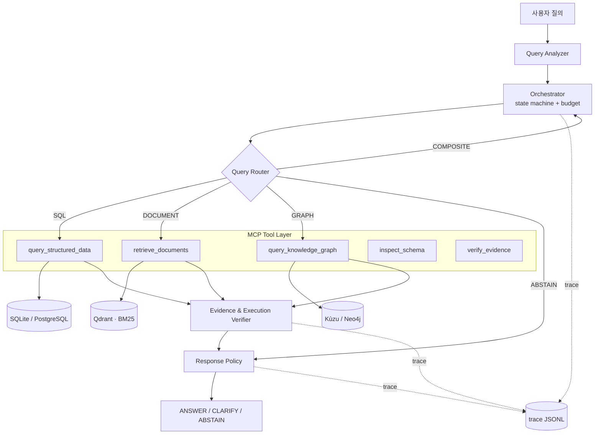

# Route–Compose–Abstain (RCA) — 플랫폼 아키텍처 v1

> **한 줄 정의** — 사용자 질의를 분석해 **정형 DB(SQL) · 비정형 문서(Hybrid RAG) · 지식 그래프(Cypher)** 중
> 필요한 정보원만 선택·조합하고, 근거가 부족하면 **답하지 않는** 다중 소스 질의응답 플랫폼.

관련 문서: [연구계획서](docs/RESEARCH_PLAN_v2.md) · [평가 결과](eval/RESULTS.md) · [README](README.md)

---

## 1. 설계 원칙

| # | 원칙 | 의미 |
|---|---|---|
| P1 | **계측 우선 (instrument-first)** | 모든 도구 호출은 종료 시(예외 포함) trace JSONL 한 줄을 남기고, 질의마다 `_run` 종결 줄을 남긴다. 논문 지표는 전부 이 로그에서 유도되며, 별도 계측 코드를 나중에 추가하지 않는다. |
| P2 | **거절은 실패가 아니다** | `ABSTAIN`/`CLARIFY`는 정상 종료 상태다. 근거 없는 답변보다 우선한다. |
| P3 | **단일 백본** | 모든 실험 조건이 동일 LLM·동일 온도·동일 시드를 쓴다. 시스템 간 차이는 오케스트레이션뿐이다. |
| P4 | **베이스라인은 config, 코드 분기가 아니다** | 8개 실험 조건이 같은 런타임을 공유한다. `if system == "react"` 분기 금지. |
| P5 | **임베디드 우선** | 외부 서버 없이 `pip install` 후 바로 실행된다. 재현성 = 리뷰어가 30분 안에 돌릴 수 있는가. |

---

## 2. 시스템 구성



---

## 3. 요청 생명주기

```
1. ingest      질의 정규화, qid 부여, RunState 생성, budget 초기화
2. analyze     의도·시간범위·엔티티 추출 (LLM 1콜 또는 규칙)
3. route       SQL | DOCUMENT | GRAPH | COMPOSITE | ABSTAIN + confidence
4. plan        COMPOSITE인 경우에만 하위 질의로 분해 (최대 3개)
5. execute     MCP 도구 호출 루프 — 매 호출 종료 시(예외 포함) trace 1줄
                 실패 → 재시도(1회) → 대체 경로 → 그래도 실패면 사유 기록
6. verify      경로별 검증 + 소스 간 충돌 검사
7. decide      Response Policy → ANSWER / CLARIFY / ABSTAIN(+사유)
8. respond     답변 + 인용 구간 + 사용한 경로 + 비용 요약
```

**예산 초과 시 어느 단계에서든 즉시 6→7로 점프**한다. 무한 루프하는 에이전트를 만들지 않는다.

---

## 4. 실행 상태 (`RunState`)

오케스트레이터는 상태 객체 하나를 들고 다닌다. 컴포넌트 간 전역 변수·암묵 공유 없음.

```python
class ToolCall(BaseModel):
    step: int
    tool: str
    input: dict
    output: dict | None
    ok: bool
    error: str | None
    retry: int
    tokens_in: int
    tokens_out: int
    latency_ms: int

class Evidence(BaseModel):
    source_type: Literal["sql", "document", "graph"]
    source_id: str            # doc_001 / table.column / node:edge 경로
    span: tuple[int, int] | None
    text: str
    score: float | None

class Budget(BaseModel):
    max_steps: int = 8
    max_calls_per_tool: int = 3
    max_tokens: int = 20_000
    deadline_ms: int = 30_000

class RunState(BaseModel):
    run_id: str
    qid: str
    question: str
    system: str                       # 실험 조건 이름 (config에서 주입)
    route_pred: Route | None
    route_conf: float | None
    plan: list[str]                   # 하위 질의
    steps: list[ToolCall]
    evidence: list[Evidence]
    budget: Budget
    verdict: Verdict | None           # ANSWER | CLARIFY | ABSTAIN
    abstain_reason: AbstainReason | None
    clarify_reason: ClarifyReason | None
    answer: str | None
    answer_confidence: float | None   # AURCC 계산에 필요한 연속 점수
    cited: list[str]                  # 실제 인용된 근거 (retrieved 와 구분)
```

구현: [`src/rca/state.py`](src/rca/state.py) · [`src/rca/trace.py`](src/rca/trace.py) (각각 `python src/rca/<file>` 로 자체 점검 실행)

---

## 5. 컴포넌트 명세

| 컴포넌트 | 책임 | 실패 시 |
|---|---|---|
| Query Analyzer | 의도·시간범위·엔티티·개인정보 요구 여부 추출 | 파싱 실패 → 규칙 fallback |
| Orchestrator | 라우팅 호출, 분해, 도구 호출 순서, 예산 관리, 재시도 | 예산 초과 → `BUDGET_EXCEEDED` |
| Query Router | 5-way 분류 + confidence | conf < τ → `LOW_ROUTER_CONFIDENCE` |
| SQL Agent | NL → QuerySpec → 검증 → 파라미터 SQL → 읽기전용 실행 | 스키마 위반 → `OUT_OF_SCHEMA`, 실행 오류 → `SQL_EXECUTION_FAILURE` |
| Document Agent | 파싱 → 청킹 → BM25+Dense → RRF → cross-encoder rerank | top-k 점수 < τ → `INSUFFICIENT_EVIDENCE` |
| Graph Agent | 엔티티 링킹 → 관계 추론 → Cypher 템플릿 → 순회 | 경로 없음 → `GRAPH_PATH_NOT_FOUND` |
| Composite Agent | 2개 이상 소스 결과 통합, 수치·서술 정합 확인 | 소스 불일치 → `SOURCE_CONFLICT` |
| Verifier | 경로별 근거 검증 + 소스 간 충돌 검사 | 미지지 → `INSUFFICIENT_EVIDENCE` |
| Response Policy | 3분기 결정 + 사유 코드 부착 | — |

### 5.1 Query Router — 4종 비교 (파인튜닝 없음)

| 변형 | 구현 | 비용 | 역할 |
|---|---|---|---|
| `rules` | 정규식 + 스키마 어휘 매칭 | ~0 | 하한선 |
| `encoder` | bge-m3 임베딩 → logistic regression (dev에서만 학습) | ~0 | **비용 대비 성능 후보** |
| `llm` | few-shot, structured output | 높음 | 통상적 접근 |
| `oracle` | gold `route_label` 주입 | — | 상한선 |

> `encoder` 변형은 임베딩 게이트가 LLM 게이트를 이길 수 있다는 선행 관찰에 근거한 가설이다.
> 이기면 "라우팅에 LLM은 과잉" 이라는 실용 기여, 지면 negative result로 보고한다.

### 5.2 Document Agent — 검색 파이프라인

```
parse(HWP/PDF/HTML) → normalize → chunk → index
                                            ├── BM25 (kiwi 형태소 토크나이저)
                                            └── Dense (bge-m3, Qdrant)
질의 → 두 경로 병렬 → RRF 융합 → cross-encoder rerank(top-50→top-5) → 근거 구간 반환
```

청킹 3종은 config 스위치(`fixed` / `semantic`(조·항 경계) / `parent_child`)이며 **dev에서만 선택**한다.

### 5.3 Graph Agent — Cypher 템플릿 우선

자유 Cypher 생성은 실패율·보안 위험이 크다. 관계 유형별 **템플릿 6종**을 두고 LLM은 템플릿 선택 + 파라미터만 채운다.

```cypher
-- T3: 상품 → 보장 → 면책 (2-hop)
MATCH (p:InsuranceProduct {name: $product})-[:PROVIDES]->(c:Coverage)
OPTIONAL MATCH (p)-[:EXCLUDES]->(e:Exclusion)
RETURN p, c, e LIMIT $limit
```

템플릿으로 못 푸는 질의는 자유 생성으로 fallback하되, **템플릿/자유 생성 비율과 각각의 성공률을 trace에 남긴다** (논문 표 하나).

---

## 6. MCP Tool Layer

MCP는 연구적 기여가 아니라 **도구 인터페이스 표준화** 수단이다. 오케스트레이터·ReAct 베이스라인·외부 클라이언트가 모두 같은 5개 도구를 본다.

| 도구 | 입력 | 출력 |
|---|---|---|
| `inspect_schema` | `{scope}` | `{tables, columns, coverage_years, row_counts}` |
| `query_structured_data` | `{queryspec}` | `{sql, rows, row_count, truncated}` |
| `retrieve_documents` | `{query, k, filters}` | `{chunks:[{id, text, span, source_id, score}]}` |
| `query_knowledge_graph` | `{entities, relation, max_hops}` | `{paths, nodes, edges, template_id}` |
| `verify_evidence` | `{claim, evidence[]}` | `{supported, coverage, conflicts[]}` |

각 도구는 입출력 JSON 스키마를 고정한다. **스키마가 곧 계약**이며, 도구 구현이 바뀌어도 오케스트레이터는 변경되지 않는다.

---

## 7. 데이터 계층

### ADR-1. 임베디드 스토어를 기본값으로 한다

**맥락** — 개발 박스에 Docker 없음. 리뷰어 재현 환경도 보장 못 함.

**결정**

| 역할 | 기본 (임베디드) | 선택 (서버) |
|---|---|---|
| 정형 | SQLite (읽기전용 커넥션) | PostgreSQL |
| 벡터 | Qdrant **local mode** (`path=`) | Qdrant 서버 |
| 그래프 | **Kùzu** (openCypher, 임베디드) | Neo4j |

**근거** — Kùzu와 Neo4j 모두 openCypher를 쓰므로 Graph Agent는 **쿼리 문자열을 공유**한다. 백엔드 차이는 커넥션 생성 함수 2개뿐이며 추상화 레이어를 만들지 않는다. 서버 모드는 `configs/base.yaml`의 `backend:` 값 하나로 전환한다.

**결과** — `pip install -r requirements.txt && python -m rca.demo` 로 전체 파이프라인 실행 가능. 컨테이너 운영 역량 증빙이 필요한 경우 `deploy/` 의 Dockerfile + compose로 서버 모드 구동.

**비용** — Kùzu는 Neo4j 대비 생태계(APOC, GDS)가 얇다. 본 연구는 순회·최단경로만 쓰므로 영향 없음.

---

## 8. 관측성 — trace JSONL (**이 아키텍처의 핵심**)

도구 호출 1회 = JSONL 1줄. 논문의 모든 정량 결과는 이 파일에서 나온다.

```json
{
  "run_id": "2026-07-23T10:11:02Z#a1b2",
  "qid": "qa_0001",
  "system": "proposed",
  "backbone": "<model-id>@2026-07",
  "temperature": 0.0,
  "seed": 0,
  "step": 2,
  "tool": "query_structured_data",
  "route_pred": "COMPOSITE",
  "route_conf": 0.81,
  "input": {"queryspec": {"table": "claim_stats", "agg": "sum", "years": [2021, 2023]}},
  "output": {"row_count": 51, "truncated": false},
  "sql": "SELECT region, SUM(amount) FROM claim_stats WHERE year BETWEEN ? AND ? GROUP BY region",
  "tokens_in": 1240,
  "tokens_out": 88,
  "latency_ms": 430,
  "ok": true,
  "retry": 0,
  "error": null,
  "evidence": [{"source_type": "sql", "source_id": "claim_stats", "span": null}]
}
```

질의마다 마지막에 **종결 줄**(`tool: "_run"`)을 하나 더 쓴다. 최종 판정·질의 지연시간·인용은 여기에만 있다 (토큰·비용은 도구 줄의 `tokens_*` 합으로 유도).

```json
{
  "run_id": "2026-07-23T10:11:02Z#a1b2",
  "qid": "qa_0001",
  "system": "proposed",
  "step": 4,
  "tool": "_run",
  "elapsed_ms": 2180,
  "verdict": "ANSWER",
  "answer_confidence": 0.72,
  "abstain_reason": null,
  "clarify_reason": null,
  "cited": ["doc_001#3", "claim_stats"]
}
```

세 필드가 왜 따로 있어야 하는지:

- `elapsed_ms` — 도구 `latency_ms` 의 합은 라우터·검증기·정책 단계를 빼먹는다. p95 지연은 이 값으로만 계산한다.
- `answer_confidence` — `verdict` 만으로는 risk–coverage 곡선에 **점 하나**밖에 찍히지 않는다. 커버리지를 쓸어 AURCC를 적분하려면 연속 점수가 필요하다.
- `cited` — 검색된 근거(`evidence`)와 **실제 인용된 근거**는 다르다. 둘을 구분하지 않으면 citation precision을 정의할 수 없다.

### 8.1 trace → 논문 지표 유도표

| 논문 지표 | 유도 방식 |
|---|---|
| Router Macro-F1, Confusion Matrix | `route_pred` vs gold `route_label` |
| Router Calibration Error, Brier | `route_conf` vs 정오 |
| SQL Execution Accuracy / Invalid Rate | `ok`, `error`, `sql` vs `gold_sql` 실행 결과 |
| Recall@k, MRR, nDCG@k | `output.chunks[].source_id` vs `gold_documents` |
| Path Recall, Invalid Path Rate | `output.paths` vs `gold_graph_paths` |
| Citation Precision, Evidence Coverage | `_run.cited` vs gold 근거 구간 (`evidence` 는 재현율 분모) |
| **AURCC (주지표)** | `_run.answer_confidence` 로 임계값 스윕 → risk–coverage 곡선 적분 |
| Abstention P/R/F1 | `_run.verdict == ABSTAIN` vs gold `answerable` |
| CLARIFY 정밀도 | `_run.clarify_reason` vs gold `ambiguous` |
| p95 latency | `_run.elapsed_ms` 의 분위수 (도구 `latency_ms` 합이 아님) |
| 질의당 호출수 / 토큰 / 비용 | `tool != "_run"` 행 수, `tokens_*` 합, 단가 곱 (`_run` 줄은 집계에서 제외) |
| MCP 호출 오버헤드 | `tool` 별 `latency_ms` 중앙값 |
| 재시도·실패율 | `retry`, `ok` |

**이 표가 유지되는 한 실험 재실행은 필요 없다.** 새 지표가 필요하면 로그를 다시 읽으면 된다.

---

## 9. 예산 · 실패 · 재시도 정책

예산 판정은 `Budget.exhausted(steps, elapsed_ms, next_tool)` 한 곳에서만 한다.
의미는 "**다음 호출을 시작할 수 있는가**"이며, 모든 한도가 동일하게 도달 즉시(`>=`) 정지한다.

```
step 한도 초과            → ABSTAIN(BUDGET_EXCEEDED)
토큰/시간 한도 초과        → ABSTAIN(BUDGET_EXCEEDED)
도구 오류                 → 1회 재시도 → 대체 경로 1회 → 사유 기록 후 중단
라우터 confidence < τ     → ABSTAIN(LOW_ROUTER_CONFIDENCE)   (τ는 dev에서 보정)
소스 간 수치 불일치        → ABSTAIN(SOURCE_CONFLICT)
필수 한정조건 누락         → CLARIFY
```

> 연구계획서 §7.8의 거절 사유 7종에 **`BUDGET_EXCEEDED` 를 추가**한다. 예산 초과는 실제로 발생하며,
> 이를 별도 코드로 두지 않으면 `INSUFFICIENT_EVIDENCE` 에 섞여 에러 분석이 왜곡된다.

---

## 10. 보안 경계 (축소 금지 영역)

SQL 경로는 사용자 입력이 DB에 닿는 유일한 지점이다. 아래는 전부 필수다.

| 통제 | 구현 |
|---|---|
| 읽기 전용 | SQLite `file:db?mode=ro`, PostgreSQL read-only role |
| 문장 종류 제한 | QuerySpec → SQL 생성기가 `SELECT`만 만든다. 자유 SQL 문자열 실행 경로 없음 |
| 다중 문장 차단 | 세미콜론 포함 시 거부 |
| 테이블·컬럼 화이트리스트 | 스키마 레지스트리에 없는 식별자는 `OUT_OF_SCHEMA` |
| 파라미터 바인딩 | 값은 100% 바인딩. 문자열 연결 금지 |
| 개인정보 차단 | PII 컬럼 blocklist + 개인 식별 질의 → `PRIVACY_RESTRICTED` |
| 자원 상한 | statement timeout, `LIMIT` 강제 상한, 결과 행수 cap |
| Cypher | 템플릿 우선. 자유 생성 시 쓰기 절(`CREATE/MERGE/DELETE/SET`) 차단 |

**출력 고지** — 본 시스템의 응답은 보험·금융·법률 **자문이 아니다**. 응답 페이로드와 데모 UI에 상시 표기한다.

---

## 11. 응답 정책

| 판정 | 조건 | 평가 처리 |
|---|---|---|
| `ANSWER` | 검증된 근거가 충분하고 소스 간 일관 | 정오 채점 대상 |
| `CLARIFY` | 연도·지역·상품 등 한정조건 부족 | 주지표에서는 미응답으로 처리, **정밀도를 별도 보고** |
| `ABSTAIN` | 사유 코드 8종 중 하나 | 미응답 |

거절 사유 8종: `OUT_OF_SCHEMA` · `INSUFFICIENT_EVIDENCE` · `LOW_ROUTER_CONFIDENCE` · `SQL_EXECUTION_FAILURE` · `GRAPH_PATH_NOT_FOUND` · `SOURCE_CONFLICT` · `PRIVACY_RESTRICTED` · `BUDGET_EXCEEDED`

명확화 사유 4종: `MISSING_TIME_RANGE` · `MISSING_REGION` · `AMBIGUOUS_ENTITY` · `MULTIPLE_INTERPRETATIONS`
— `CLARIFY` 를 사유 없이 내보내면 "무엇이 부족했는지"를 사후에 복원할 수 없어 §11의 별도 보고가 불가능해진다.

---

## 12. 실험 하네스 — 조건은 config다

8개 실험 조건이 **같은 런타임**을 공유한다. 코드에 `if system == ...` 분기를 두지 않는다.

가변 축은 넷뿐이며, 각 축의 구현체는 **미리 정해진 유한 집합**에서 고른다. 임의 확장을 위한 플러그인 레지스트리는 만들지 않는다.

| 축 | 허용 값 |
|---|---|
| `orchestrator` | `planned` (라우팅→계획→실행 루프) · `react` (LLM 자유 도구 선택 루프) — **루프 구현 2종** |
| `router` | `fixed` · `rules` · `encoder` · `llm` · `oracle` · `none` |
| `verifier` | `none` · `per_path` |
| `abstention` | `none` · `calibrated` · `oracle` |

`oracle_route` / `oracle_abstain` 는 별도 코드가 아니라 `planned` 루프에 gold 라벨을 주입하는 `router: oracle` / `abstention: oracle` 설정이다.

```yaml
# configs/systems/doc_only.yaml
name: doc_only
router:     {type: fixed, route: DOCUMENT}
tools:      [retrieve_documents]
composite:  false
verifier:   none
abstention: none
```

```yaml
# configs/systems/react.yaml   ← 진짜 경쟁자 베이스라인
name: react
router:      {type: none}
orchestrator: react            # LLM이 도구를 자유 선택
tools:       [inspect_schema, query_structured_data, retrieve_documents, query_knowledge_graph]
verifier:    none
abstention:  none
```

```yaml
# configs/systems/proposed.yaml
name: proposed
router:      {type: encoder, model: bge-m3, threshold: 0.55}
orchestrator: planned
tools:       [inspect_schema, query_structured_data, retrieve_documents, query_knowledge_graph, verify_evidence]
composite:   true
verifier:    per_path
abstention:  {calibrated: true, target_coverage: 0.80}
```

조건 목록: `doc_only` · `sql_only` · `graph_only` · `always_all` · `react` · `proposed` · `oracle_route` · `oracle_abstain`

> **부수 효과** — `always_all` 실행은 모든 질의를 3개 스토어에 전부 태운다.
> 그 trace 하나로 **질의 × 스토어 성능 행렬**과 **oracle 상한**이 추가 비용 없이 나온다 (RQ1·RQ2 동시 해결).

---

## 13. 재현성

- `temperature=0`, `seed=0` 고정, 모델 ID + 스냅샷 날짜를 매 trace 줄에 기록
- 임계값(τ)·하이브리드 가중치(α)·청킹 방식은 **dev 분할에서만** 조정, test는 1회 실행
- 데이터 분할 **dev 20% / test 80%** (파인튜닝 없음 → train 분할을 두지 않는다)
- 원문 재배포가 제한되는 문서는 URL·해시·수집 스크립트·전처리 코드만 공개
- 실행 커맨드 1줄 재현: `python -m rca.run --system proposed --split test`

---

## 14. 디렉토리 구조

```
route-compose-abstain/
├── ARCHITECTURE_v1.md
├── README.md
├── requirements.txt
├── configs/
│   ├── base.yaml                  # 백본, 백엔드, 경로
│   └── systems/*.yaml             # 실험 조건 8개
├── src/rca/
│   ├── state.py                   # RunState / ToolCall / Evidence / Budget
│   ├── trace.py                   # JSONL writer          ← 1일차 필수
│   ├── orchestrator.py            # 상태 머신 + 예산
│   ├── router/{rules,encoder,llm,oracle}.py
│   ├── tools/{schema,sql,docs,graph,verify}.py
│   ├── mcp_server.py              # 도구 5종 노출
│   ├── policy.py                  # ANSWER / CLARIFY / ABSTAIN
│   └── api.py                     # FastAPI 데모
├── data/
│   ├── raw/ structured/ docs/ graph/
├── eval/
│   ├── qa/                        # gold JSONL (라벨 2인 + κ)
│   ├── runs/                      # trace JSONL
│   ├── analyze.py                 # trace → 지표 표·그림
│   └── RESULTS.md
├── deploy/                        # Dockerfile, compose (서버 모드 선택 시)
├── scripts/                       # 수집·색인·그래프 구축
└── tests/
```

---

## 15. 비범위 (지금 만들지 않음)

인증·멀티테넌시 · 스토어 플러그인 레지스트리 · 스트리밍 응답 · 캐시 레이어 · 대화 이력 관리 ·
k8s 매니페스트 · 프런트엔드 프레임워크 · LangChain 위에 얹는 자체 추상화 · 모델 파인튜닝/LoRA · 멀티모달·VLM 경로.

`deploy/`의 Dockerfile + 3-서비스 compose 로 컨테이너 운영 요건은 충족한다. 그 이상은 논문에도 데모에도 쓰이지 않는다.

---

## 16. 열린 이슈

| # | 이슈 | 처리 시점 |
|---|---|---|
| O1 | route 라벨 2인 주석 + κ 측정 프로토콜 확정 | 데이터 구축 **전** (필수) |
| O2 | contrastive unanswerable 생성 규칙 확정 | 데이터 구축 **전** (필수) |
| O3 | 지식 그래프 구축 방식(규칙/LLM추출/수작업) 및 트리플 샘플 감사 절차 | Step 1 |
| O4 | Faithfulness·Evidence Coverage 판정자 선정 + 사람 일치율 측정(n≥100) | Step 3 |
| O5 | 거절 임계값 보정 방식(온도 스케일링 vs 분위수) 선택 | Step 3, dev에서 |
| O6 | 한국어 cross-encoder reranker 후보 선정 | Step 2 |

O1·O2는 **데이터를 만들기 시작하면 되돌릴 수 없다.** 코드보다 먼저 확정한다.
