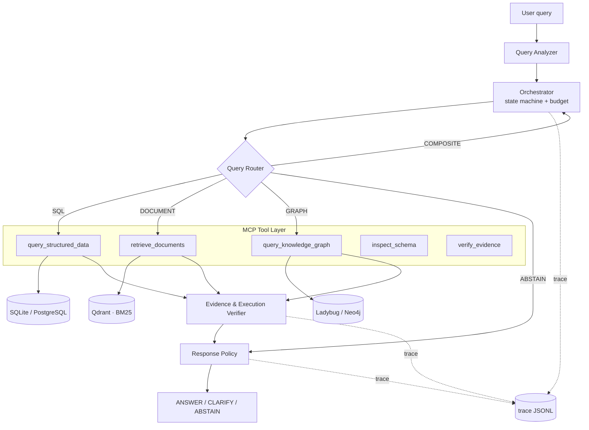

# Route–Compose–Abstain (RCA) — Platform Architecture v1

> **One-line definition** — A multi-source question-answering platform that analyzes a user query, selects and combines only the
> information sources it needs among **structured DB (SQL) · unstructured documents (Hybrid RAG) · knowledge graph (Cypher)**, and **does not answer** when evidence is insufficient.

Related documents: [Research Plan](docs/RESEARCH_PLAN_v2.md) · [Evaluation Results](eval/RESULTS.md) · [README](README.md)

---

## 1. Design Principles

| # | Principle | Meaning |
|---|---|---|
| P1 | **Instrument-first** | Every tool call writes one trace JSONL line on exit (including on exception), and every query writes a `_run` terminating line. All paper metrics are derived from this log; no separate instrumentation code is added later. |
| P2 | **Abstention is not a failure** | `ABSTAIN`/`CLARIFY` are normal terminal states. They take precedence over an answer without evidence. |
| P3 | **Single backbone** | Every experimental condition uses the same LLM, the same temperature, and the same seed. The only difference between systems is orchestration. |
| P4 | **Baselines are config, not code branches** | The 8 experimental conditions share one runtime. No `if system == "react"` branching. |
| P5 | **Embedded-first** | Runs immediately after `pip install`, with no external server. Reproducibility = can a reviewer run it within 30 minutes. |

---

## 2. System Composition



---

## 3. Request Lifecycle

```
1. ingest      normalize the query, assign qid, create RunState, initialize budget
2. analyze     extract intent, time range, entities (1 LLM call or rules)
3. route       SQL | DOCUMENT | GRAPH | COMPOSITE | ABSTAIN + confidence
4. plan        decompose into sub-queries only when COMPOSITE (at most 3)
5. execute     MCP tool call loop — 1 trace line on every call exit (including exceptions)
                 failure → retry (1 attempt) → fallback path → if it still fails, record the reason
6. verify      per-path verification + cross-source conflict check
7. decide      Response Policy → ANSWER / CLARIFY / ABSTAIN (+reason)
8. respond     answer + cited spans + paths used + cost summary
```

**On budget exhaustion, jump straight from any stage to 6→7.** We do not build agents that loop forever.

---

## 4. Execution State (`RunState`)

The orchestrator carries a single state object. No global variables, no implicit sharing between components.

```python
class ToolCall(BaseModel):
    step: int
    tool: str
    input: dict
    output: dict | None
    ok: bool
    error: str | None
    retry: int
    tokens_in: int
    tokens_out: int
    latency_ms: int

class Evidence(BaseModel):
    source_type: Literal["sql", "document", "graph"]
    source_id: str            # doc_001 / table.column / node:edge path
    span: tuple[int, int] | None
    text: str
    score: float | None

class Budget(BaseModel):
    max_steps: int = 8
    max_calls_per_tool: int = 3
    max_tokens: int = 20_000
    deadline_ms: int = 30_000

class RunState(BaseModel):
    run_id: str
    qid: str
    question: str
    system: str                       # experimental condition name (injected from config)
    route_pred: Route | None
    route_conf: float | None
    plan: list[str]                   # sub-queries
    steps: list[ToolCall]
    evidence: list[Evidence]
    budget: Budget
    verdict: Verdict | None           # ANSWER | CLARIFY | ABSTAIN
    abstain_reason: AbstainReason | None
    clarify_reason: ClarifyReason | None
    answer: str | None
    answer_confidence: float | None   # continuous score needed to compute AURC
    cited: list[str]                  # evidence actually cited (distinct from retrieved)
```

Implementation: [`src/rca/state.py`](src/rca/state.py) · [`src/rca/trace.py`](src/rca/trace.py) (each runs its own self-check via `python src/rca/<file>`)

---

## 5. Component Specification

| Component | Responsibility | On failure |
|---|---|---|
| Query Analyzer | extract intent, time range, entities, and whether personal data is requested | parse failure → rule fallback |
| Orchestrator | routing calls, decomposition, tool call ordering, budget management, retries | budget exhausted → `BUDGET_EXCEEDED` |
| Query Router | 5-way classification + confidence | conf < τ → `LOW_ROUTER_CONFIDENCE` |
| SQL Agent | NL → QuerySpec → validation → parameterized SQL → read-only execution | schema violation → `OUT_OF_SCHEMA`, execution error → `SQL_EXECUTION_FAILURE` |
| Document Agent | parse → chunk → BM25+Dense → RRF → cross-encoder rerank | top-k score < τ → `INSUFFICIENT_EVIDENCE` |
| Graph Agent | entity linking → relation inference → Cypher template → traversal | no path → `GRAPH_PATH_NOT_FOUND` |
| Composite Agent | integrate results from 2 or more sources, check numeric/narrative consistency | source mismatch → `SOURCE_CONFLICT` |
| Verifier | per-path evidence verification + cross-source conflict check | unsupported → `INSUFFICIENT_EVIDENCE` |
| Response Policy | 3-way decision + attach reason code | — |

### 5.1 Query Router — 4 variants compared (no fine-tuning)

| Variant | Implementation | Cost | Role |
|---|---|---|---|
| `rules` | regex + schema vocabulary matching | ~0 | lower bound |
| `encoder` | bge-m3 embeddings → logistic regression (trained on dev only) | ~0 | **cost-effectiveness candidate** |
| `llm` | few-shot, structured output | high | conventional approach |
| `oracle` | inject gold `route_label` | — | upper bound |

> The `encoder` variant is a hypothesis grounded in a prior observation that an embedding gate can beat an LLM gate.
> If it wins, that is a practical contribution — "an LLM is overkill for routing"; if it loses, we report it as a negative result.

### 5.2 Document Agent — retrieval pipeline

```
parse(HWP/PDF/HTML) → normalize → chunk → index
                                            ├── BM25 (kiwi morphological tokenizer)
                                            └── Dense (bge-m3, Qdrant)
query → both paths in parallel → RRF fusion → cross-encoder rerank(top-50→top-5) → return evidence spans
```

The 3 chunking modes are a config switch (`fixed` / `semantic` (Article/Clause boundaries) / `parent_child`) and are **selected on dev only**.

### 5.3 Graph Agent — Cypher templates first

Free-form Cypher generation has a high failure rate and a large security risk. We keep **6 templates**, one per relation type, and the LLM only selects a template and fills in its parameters.

```cypher
-- T3: product → coverage → exclusion (2-hop)
MATCH (p:InsuranceProduct {name: $product})-[:PROVIDES]->(c:Coverage)
OPTIONAL MATCH (p)-[:EXCLUDES]->(e:Exclusion)
RETURN p, c, e LIMIT $limit
```

Queries the templates cannot handle fall back to free-form generation, but **the template/free-form ratio and the success rate of each are recorded in the trace** (one table in the paper).

---

## 6. MCP Tool Layer

MCP is not a research contribution; it is a means of **standardizing the tool interface**. The orchestrator, the ReAct baseline, and external clients all see the same 5 tools.

| Tool | Input | Output |
|---|---|---|
| `inspect_schema` | `{scope}` | `{tables, columns, coverage_years, row_counts}` |
| `query_structured_data` | `{queryspec}` | `{sql, rows, row_count, truncated}` |
| `retrieve_documents` | `{query, k, filters}` | `{chunks:[{id, text, span, source_id, score}]}` |
| `query_knowledge_graph` | `{entities, relation, max_hops}` | `{paths, nodes, edges, template_id}` |
| `verify_evidence` | `{claim, evidence[]}` | `{supported, coverage, conflicts[]}` |

Each tool fixes its input/output JSON schema. **The schema is the contract**: the orchestrator does not change even when a tool implementation does.

---

## 7. Data Layer

### ADR-1. Embedded stores are the default

**Context** — No Docker on the dev box. We cannot guarantee the reviewer's reproduction environment either.

**Decision**

| Role | Default (embedded) | Optional (server) |
|---|---|---|
| Structured | SQLite (read-only connection) | PostgreSQL |
| Vector | Qdrant **local mode** (`path=`) | Qdrant server |
| Graph | **Ladybug** (openCypher, embedded) | Neo4j (unverified) |

**Rationale** — Running immediately after `pip install` with no external server is the practical precondition for reproducibility (there is no container runtime on the dev box).

**Graph backend history (correction)** — The initial design used Kùzu and stated that "since it is openCypher, Kùzu↔Neo4j query strings are shared, and the swap cost is 2 connection functions", but **neither claim was true**. (1) Kùzu's upstream was archived in 2025-10, so we moved to the successor fork **Ladybug 0.18**. (2) Even with shared openCypher, queries do not port as-is: schema DDL is mandatory, shortest-path syntax differs, and walk/trail semantics differ. We therefore **fix the backend to Ladybug alone** and mark Neo4j as "unverified; switching would require rewriting the Graph Agent". This correction is itself an instance of technical risk identification.

**Consequence** — After `pip install -r requirements.txt`, building the three stores with `scripts/build_*.py` makes the whole pipeline run locally. Since Ladybug is used only for traversal and 2-hop queries, the absence of the Neo4j ecosystem (APOC/GDS) has no impact.

---

## 8. Observability — trace JSONL (**the core of this architecture**)

1 tool call = 1 JSONL line. Every quantitative result in the paper comes out of this file.

```json
{
  "run_id": "2026-07-23T10:11:02Z#a1b2",
  "qid": "qa_0001",
  "system": "proposed",
  "backbone": "<model-id>@2026-07",
  "temperature": 0.0,
  "seed": 0,
  "step": 2,
  "tool": "query_structured_data",
  "route_pred": "COMPOSITE",
  "route_conf": 0.81,
  "input": {"queryspec": {"table": "claim_stats", "agg": "sum", "years": [2021, 2023]}},
  "output": {"row_count": 51, "truncated": false},
  "sql": "SELECT region, SUM(amount) FROM claim_stats WHERE year BETWEEN ? AND ? GROUP BY region",
  "tokens_in": 1240,
  "tokens_out": 88,
  "latency_ms": 430,
  "ok": true,
  "retry": 0,
  "error": null,
  "evidence": [{"source_type": "sql", "source_id": "claim_stats", "span": null}]
}
```

Each query writes one more **terminating line** (`tool: "_run"`) at the end. The final verdict, query latency, and citations exist only here (tokens and cost are derived from the sum of `tokens_*` over the tool lines).

```json
{
  "run_id": "2026-07-23T10:11:02Z#a1b2",
  "qid": "qa_0001",
  "system": "proposed",
  "step": 4,
  "tool": "_run",
  "elapsed_ms": 2180,
  "verdict": "ANSWER",
  "answer_confidence": 0.72,
  "abstain_reason": null,
  "clarify_reason": null,
  "cited": ["doc_001#3", "claim_stats"]
}
```

Why these three fields must exist separately:

- `elapsed_ms` — the sum of per-tool `latency_ms` omits the router, verifier, and policy stages. p95 latency is computed from this value only.
- `answer_confidence` — `verdict` alone puts only **a single point** on the risk–coverage curve. Sweeping coverage to integrate AURC requires a continuous score.
- `cited` — retrieved evidence (`evidence`) and **evidence actually cited** are different. Without distinguishing the two, citation precision cannot be defined.

Definition of `ok`: **whether the tool executed successfully**, not whether evidence was sufficient.
When retrieval comes back empty and the verification stage abstains, it is recorded as `ok=True` + `_run.abstain_reason=INSUFFICIENT_EVIDENCE`.
Conflating the two contaminates the SQL invalid query rate with cases where "the query was fine but there was no evidence".

### 8.1 trace → paper metric derivation table

| Paper metric | Derivation |
|---|---|
| Router Macro-F1, Confusion Matrix | `route_pred` vs gold `route_label` |
| Router Calibration Error, Brier | `route_conf` vs correctness |
| SQL Execution Accuracy / Invalid Rate | `ok`, `error`, `sql` vs `gold_sql` execution results |
| Recall@k, MRR, nDCG@k | `output.chunks[].source_id` vs `gold_documents` |
| Path Recall, Invalid Path Rate | `output.paths` vs `gold_graph_paths` |
| Citation Precision, Evidence Coverage | `_run.cited` vs gold evidence spans (`evidence` is the recall denominator) |
| **AURC (primary metric)** | threshold sweep over `_run.answer_confidence` → integrate the risk–coverage curve |
| Abstention P/R/F1 | `_run.verdict == ABSTAIN` vs gold `answerable` |
| CLARIFY precision | `_run.clarify_reason` vs gold `ambiguous` |
| p95 latency | quantile of `_run.elapsed_ms` (not the sum of per-tool `latency_ms`) |
| Calls / tokens / cost per query | count of `tool != "_run"` rows, sum of `tokens_*`, times unit price (`_run` lines excluded from aggregation) |
| MCP call overhead | median `latency_ms` per `tool` |
| Retry / failure rate | `retry`, `ok` |

**As long as this table holds, no experiment has to be re-run.** If a new metric is needed, just read the logs again.

---

## 9. Budget, Failure, and Retry Policy

The budget decision is made in exactly one place, `Budget.exhausted(steps, elapsed_ms, next_tool)`.
It means "**can the next call be started**", and every limit stops uniformly the moment it is reached (`>=`).

```
step limit exceeded         → ABSTAIN(BUDGET_EXCEEDED)
token/time limit exceeded   → ABSTAIN(BUDGET_EXCEEDED)
tool error                  → 1 retry → 1 fallback path → record the reason and stop
router confidence < τ       → ABSTAIN(LOW_ROUTER_CONFIDENCE)   (τ is calibrated on dev)
cross-source numeric mismatch → ABSTAIN(SOURCE_CONFLICT)
missing required qualifier  → CLARIFY
```

> We **add `BUDGET_EXCEEDED`** to the 7 abstention reasons in §7.8 of the research plan. Budget exhaustion does occur in practice, and
> without a code of its own it gets mixed into `INSUFFICIENT_EVIDENCE` and distorts the error analysis.

---

## 10. Security Boundary (no-cut zone)

The SQL path is the only point where user input reaches the DB. Everything below is mandatory.

| Control | Implementation |
|---|---|
| Read-only | SQLite `file:db?mode=ro`, PostgreSQL read-only role |
| Statement type restriction | The QuerySpec → SQL generator emits only `SELECT`. There is no execution path for free-form SQL strings |
| Multi-statement blocking | rejected if it contains a semicolon |
| Table/column whitelist | identifiers not in the schema registry → `OUT_OF_SCHEMA` |
| Parameter binding | values are 100% bound. No string concatenation |
| Personal data blocking | PII column blocklist + person-identifying queries → `PRIVACY_RESTRICTED` |
| Resource limits | statement timeout, enforced `LIMIT` ceiling, result row cap |
| Cypher | templates first. On free-form generation, write clauses (`CREATE/MERGE/DELETE/SET`) are blocked |

**Output disclaimer** — Responses from this system are **not** insurance, financial, or legal **advice**. This is displayed at all times in the response payload and the demo UI.

---

## 11. Response Policy

| Verdict | Condition | Evaluation handling |
|---|---|---|
| `ANSWER` | verified evidence is sufficient and sources are consistent | scored for correctness |
| `CLARIFY` | a qualifier such as year, region, or product is missing | treated as a non-response in the primary metric, **precision reported separately** |
| `ABSTAIN` | one of the 8 reason codes | non-response |

The 8 abstention reasons: `OUT_OF_SCHEMA` · `INSUFFICIENT_EVIDENCE` · `LOW_ROUTER_CONFIDENCE` · `SQL_EXECUTION_FAILURE` · `GRAPH_PATH_NOT_FOUND` · `SOURCE_CONFLICT` · `PRIVACY_RESTRICTED` · `BUDGET_EXCEEDED`

The 4 clarification reasons: `MISSING_TIME_RANGE` · `MISSING_REGION` · `AMBIGUOUS_ENTITY` · `MULTIPLE_INTERPRETATIONS`
— Emitting `CLARIFY` without a reason makes it impossible to reconstruct "what was missing" after the fact, which makes the separate reporting in §11 impossible.

---

## 12. Experiment Harness — conditions are config

The 8 experimental conditions share **one runtime**. There is no `if system == ...` branch in the code.

There are only four variable axes, and each axis picks its implementation from a **predefined finite set**. We do not build a plugin registry for arbitrary extension.

| Axis | Allowed values |
|---|---|
| `orchestrator` | `planned` (route→plan→execute loop) · `react` (LLM free tool-selection loop) — **2 loop implementations** |
| `router` | `fixed` · `rules` · `encoder` · `llm` · `oracle` · `none` |
| `verifier` | `none` · `per_path` |
| `abstention` | `none` · `calibrated` · `oracle` |

`oracle_route` / `oracle_abstain` are not separate code; they are the `router: oracle` / `abstention: oracle` settings that inject gold labels into the `planned` loop.

```yaml
# configs/systems/doc_only.yaml
name: doc_only
router:     {type: fixed, route: DOCUMENT}
tools:      [retrieve_documents]
composite:  false
verifier:   none
abstention: none
```

```yaml
# configs/systems/react.yaml   ← the real competitor baseline
name: react
router:      {type: none}
orchestrator: react            # the LLM freely selects tools
tools:       [inspect_schema, query_structured_data, retrieve_documents, query_knowledge_graph]
verifier:    none
abstention:  none
```

```yaml
# configs/systems/proposed.yaml
name: proposed
router:      {type: encoder, model: bge-m3, threshold: 0.55}
orchestrator: planned
tools:       [inspect_schema, query_structured_data, retrieve_documents, query_knowledge_graph, verify_evidence]
composite:   true
verifier:    per_path
abstention:  {calibrated: true, target_coverage: 0.80}
```

Condition list: `doc_only` · `sql_only` · `graph_only` · `always_all` · `react` · `proposed` · `oracle_route` · `oracle_abstain`

> **Side effect** — Running `always_all` sends every query through all 3 stores.
> That single trace yields the **query × store performance matrix** and the **oracle upper bound** at no extra cost (solving RQ1 and RQ2 at once).

---

## 13. Reproducibility

- `temperature=0`, `seed=0` fixed; model ID + snapshot date recorded on every trace line
- Thresholds (τ), hybrid weights (α), and the chunking mode are tuned **on the dev split only**; test is run once
- Data split **dev 20% / test 80%** (no fine-tuning → no train split)
- For documents whose originals cannot be redistributed, we release only the URL, hash, collection script, and preprocessing code
- 1-line command reproduction: `python -m rca.run --system proposed --split test`

---

## 14. Directory Structure

```
route-compose-abstain/
├── ARCHITECTURE_v1.md
├── README.md
├── requirements.txt
├── configs/
│   ├── base.yaml                  # backbone, backends, paths
│   └── systems/*.yaml             # 8 experimental conditions
├── src/rca/
│   ├── state.py                   # RunState / ToolCall / Evidence / Budget
│   ├── trace.py                   # JSONL writer          ← required on day 1
│   ├── orchestrator.py            # state machine + budget
│   ├── router/{rules,encoder,llm,oracle}.py
│   ├── tools/{schema,sql,docs,graph,verify}.py
│   ├── mcp_server.py              # exposes the 5 tools
│   ├── policy.py                  # ANSWER / CLARIFY / ABSTAIN
│   ├── demo.py                    # stub tool wiring check   ← works
│   └── api.py                     # FastAPI demo
├── data/
│   ├── raw/ structured/ docs/ graph/
├── eval/
│   ├── qa/                        # gold JSONL (2 annotators + κ)  ← demo_gold.jsonl, 8 items
│   ├── runs/                      # trace JSONL
│   ├── analyze.py                 # trace → metric tables/figures  ← works
│   └── RESULTS.md
├── deploy/                        # Dockerfile, compose (when server mode is selected)
├── scripts/                       # collection, indexing, graph construction
└── tests/
```

---

## 15. Non-scope (not building now)

Auth/multi-tenancy · store plugin registry · streaming responses · cache layer · conversation history management ·
k8s manifests · frontend framework · a home-grown abstraction layered on LangChain · model fine-tuning/LoRA · multimodal/VLM paths.

The Dockerfile + 3-service compose in `deploy/` satisfy the container operations requirement. Anything beyond that is used in neither the paper nor the demo.

---

## 16. Open Issues

| # | Issue | When addressed |
|---|---|---|
| O1 | finalize the 2-annotator protocol for route labels + κ measurement | **before** data construction (mandatory) |
| O2 | finalize the generation rules for contrastive unanswerables | **before** data construction (mandatory) |
| O3 | knowledge graph construction method (rules / LLM extraction / manual) and the triple sample audit procedure | Step 1 |
| O4 | select the judge for Faithfulness and Evidence Coverage + measure human agreement (n≥100) | Step 3 |
| O5 | choose the abstention threshold calibration method (temperature scaling vs quantile) | Step 3, on dev |
| O6 | select candidate Korean cross-encoder rerankers | Step 2 |

O1 and O2 **cannot be undone once data construction starts.** They are finalized before any code.
